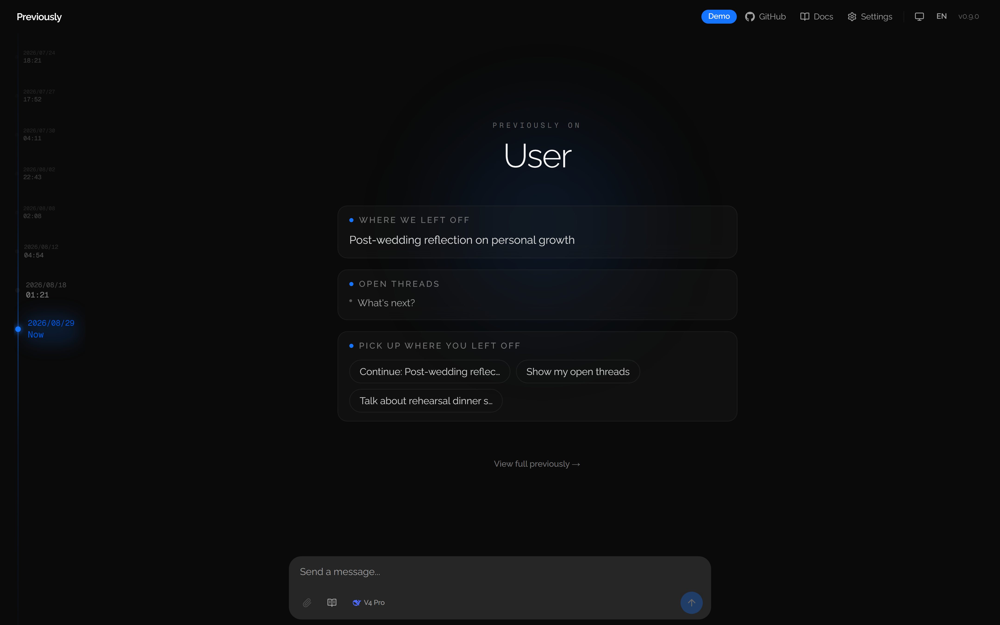
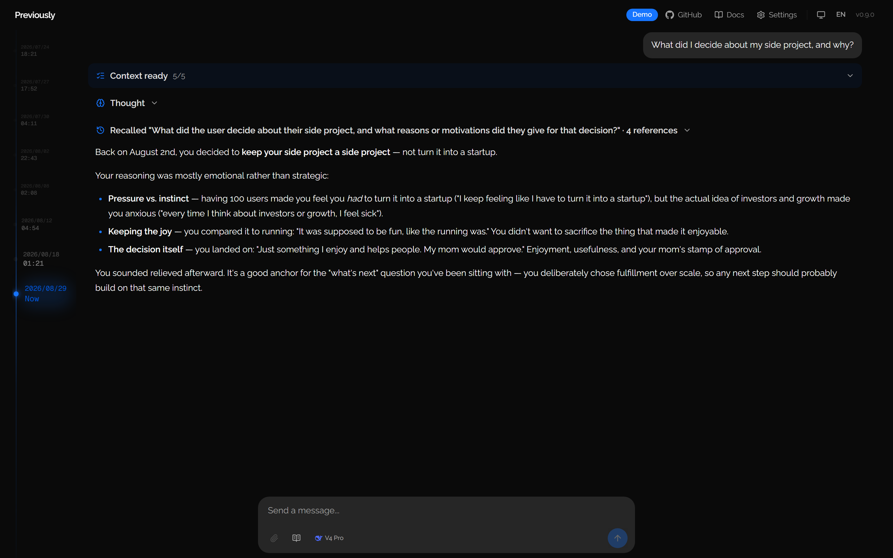
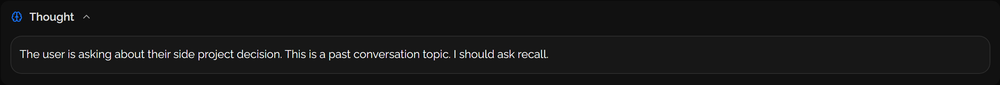
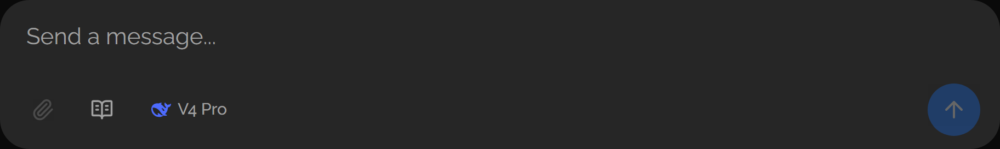
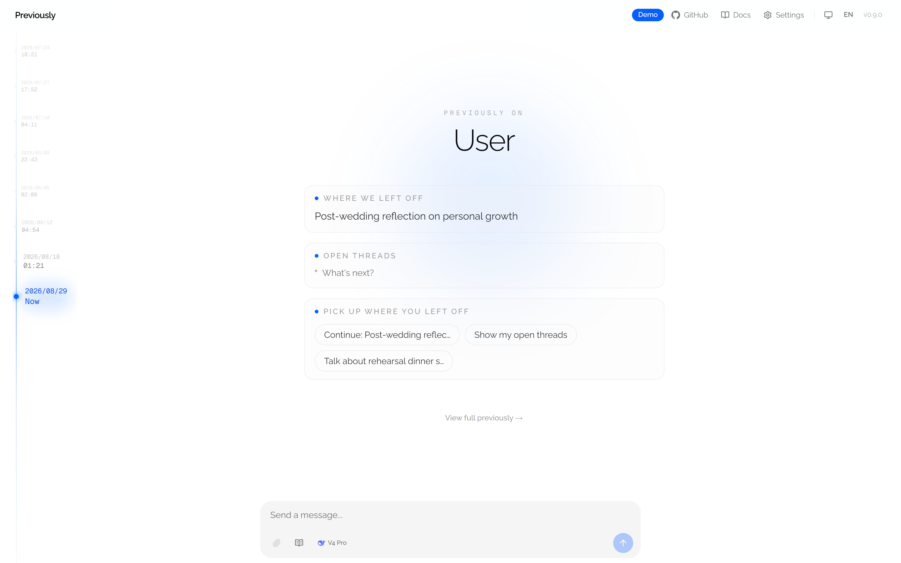
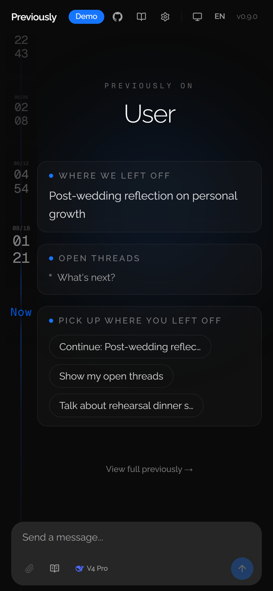
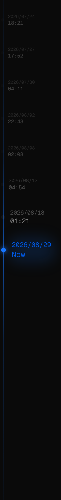
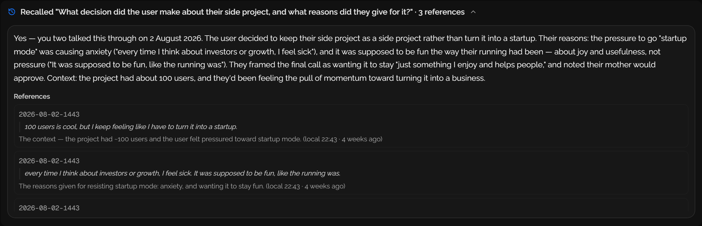

<p align="center">
  <a href="README.md">English</a> · <a href="README.zh-CN.md">中文</a>
</p>

<p align="center">
  
</p>

<p align="center">
  <strong>Previously on you.</strong>
</p>

<p align="center">
  An AI agent that remembers by <em>when</em>, not by chat thread.
</p>

<p align="center">
  <a href="https://previously.ldwid.com"><strong>previously.ldwid.com</strong></a>
  ·
  <a href="https://previously.ldwid.com/docs/recall"><strong>Playground</strong></a>
  ·
  <a href="https://previously.ldwid.com/docs"><strong>Docs</strong></a>
  ·
  <a href="https://github.com/previously-lab/agent"><strong>GitHub</strong></a>
</p>

<p align="center">
  
  
  <a href="https://sdk.vercel.ai"></a>
  
  
  
  
</p>

---

## What this is

Previously is a lightweight cloud agent that lives on the edge — open a browser tab and it's there. It reads, writes, reasons, and acts on your behalf. What makes it different isn't any single feature; it's that there are no "conversations." Just one continuous relationship, organized on a timeline.

Most AI agents split your life into chat threads. Each new thread starts cold. Memory is siloed, fragile, lossy. The conversation list — a UI artifact from messaging apps — became the default interaction model for AI, even though human relationships don't work that way.

Previously replaces chat threads with **time slices**: episodic memory organized the way human memory actually works — by _when_ something happened, then _what_ it was about. You don't manage conversations. You just show up and talk. And because context is assembled dynamically from the timeline rather than crammed into a growing prompt window, there's no point where the agent suddenly "forgets" the beginning of a long exchange.

The name comes from how TV series recap previous episodes: _"Previously on…"_ — a brief reminder of what happened last time, just enough context to pick up where you left off.

> Want to understand the ideas behind this? Read the deep-dive: [Is Time the Missing Dimension in AI Memory?](https://dev.to/likedreamwalker/is-time-the-missing-dimension-in-ai-memory-2l9c)

---

## What it looks like

Every time you open it, you see a timeline of your past — not a list of chat threads. The agent's thinking, its memory recall, and every tool call it makes are rendered inline as the answer streams in. Nothing happens in a black box.

<p align="center">
  
</p>

<p align="center">
  <sub>A real agent turn: it thinks, recalls what it knows about you, reads memory files, searches the web, and answers — all visible inline.</sub>
</p>

The thinking, the recall, and the input bar — each piece is its own card.

<p align="center">
  
  <br>
  
</p>

Light or dark, desktop or phone — it adapts.

<p align="center">
  
  <br>
  
</p>

---

## Why this matters

Two problems that are really one:

1. **Memory across conversations is broken.** Cross-conversation recall requires vector databases, RAG pipelines, and fragile prompt engineering — and it still feels like talking to someone with amnesia.

2. **The conversation is not the right container.** Humans don't organize their memories into "Chat #47." They remember by _when_ something happened and _what_ it was about. The conversation list is a UI artifact — not a cognitive model.

Fixing the memory model fixes the interaction model. If an agent genuinely remembers you across time and topics, you don't need conversation management. You just show up and talk.

---

## Slice, Strand, Recall

**A slice** is one conversation burst — a Markdown file on the timeline. It opens when you start talking and closes after 30 minutes of silence. Each slice carries a summary, decisions, open loops, and tags in YAML frontmatter. Read top to bottom across months and years, slices are your autobiography.

**A strand** is a keyword — like `work`, `family`, `health` — that appears across multiple slices. A lightweight index maps each strand to every slice that carries it: the whole history of that topic.

> Slice = what happened. Strand = what it was about. Together they give you both episodic and semantic memory — remembering by time, and remembering by topic.

<p align="center">
  
</p>

When you ask something that touches the past, the main agent asks a **recall colleague** — a dedicated sub-agent that searches memory the way a person remembers: time window first, then topic strands, then full slice reads (quota-bounded). It answers in natural language with verbatim-quote references and its searched trail — and "we don't remember that" is an honest, valid answer. The result renders as a card above the answer.

<p align="center">
  
</p>

For the full picture — the recall colleague's contract, file structure, YAML schemas, and the cognitive science behind it — see the [Memory Model](https://previously.ldwid.com/docs/memory-model) and [Architecture](https://previously.ldwid.com/docs/architecture) docs.

---

## How it's built

Three layers, one hard rule between them:

| Layer | What it is | What it does |
|-------|-----------|--------------|
| **Browser / Phone** | Next.js UI | Renders the chat, captures input, streams the response. No business logic. |
| **Vercel** | Orchestration | Reads GitHub state → LLM decision → execute → write back. Stateless, event-driven. |
| **GitHub repo** | The truth | `src/` (agent-read-only) + `memory/`/`tasks/`/`sessions/` (agent-read-write). |

Two things make this unusual:

**No database.** Your memory is plain Markdown with YAML frontmatter, committed to your own private GitHub repository. Every file is readable by any tool, portable to any system, version-controlled by git. There is no cloud database, no vector store, no proprietary format. Your memory belongs to you.

**Every turn is a durable run.** Each chat turn runs inside a Vercel Workflow run — every LLM call and tool call is an individually durable, auto-retried step. Close the tab, lock your phone, drop the connection: the agent keeps going, and when you come back it re-attaches and shows you what you missed. Background loops work the same way.

---

## What it can do

- **Episodic memory** — time-slice storage with a single rule (30 min of silence closes a slice)
- **Visible reasoning** — thinking, recall, and tool calls stream inline; nothing happens in a black box
- **Colleague recall** — a recall sub-agent searches memory with evidence-anchored, verbatim-quoted answers; the main agent keeps only a verification channel
- **Darwinian self-evolution** — a direction document (`memory/evolution/direction.md`) defines what "better for you" means; evidence-anchored fitness scoring decides *whether* to evolve; every accepted change lands in an append-only mutations archive. The user card is a product of that loop, not the loop itself
- **Local time, everywhere** — read tools pre-render your local time, so the agent never mangles timezones
- **Trivial turns stay out of memory** — a semantic gate keeps "thanks" and "continue" from polluting your timeline
- **Multi-model** — DeepSeek, Anthropic, and any OpenAI-compatible provider, with a pick-your-main-model toolbar
- **Client mode** — run the whole thing as a local kernel: your own agent CLI (Claude/Codex/Kimi) as the default zero-setup engine, or bring your own API key (BYOK) for the full streaming experience
- **Durable background loops** — long-running tasks persist across disconnects and report back
- **English & 中文** — fully internationalized, with a dark theme

---

## Try it in the playground

The docs site embeds an **interactive playground** — real recall and self-evolution runs against [`you`](https://github.com/previously-lab/you), a fictional memory dataset (97 slices, 2024→2026) generated by [Loom](https://github.com/previously-lab/loom). No signup, no API key: pick a preset question on the [recall page](https://previously.ldwid.com/docs/recall) and watch the agent actually remember, live — the thinking stream, the exploration trail, and the streamed answer are all real.

---

## Run it yourself

**The easy way — local client (recommended).** One npm package installs the kernel on your machine; your memory is a local git repo, and the brain can be your existing Claude/Codex/Kimi subscription (zero API keys) or your own key:

```bash
npm i -g @previously-lab/client@preview
previously     # guided setup on first run
```

See [previously-lab/client](https://github.com/previously-lab/client) and the [docs](https://previously.ldwid.com/docs/getting-started).

**The cloud way — self-host this repo.** A Next.js app on Vercel with your own GitHub repo as the store:

1. **Create a repo** — click "Use this template" on the [Previously repo](https://github.com/previously-lab/agent), or fork it, and make it **private**. Your memory lives there.

2. **Deploy to Vercel** — [import your repo](https://vercel.com/new) and set these environment variables:

   | Variable | What it's for |
   |----------|---------------|
   | `GITHUB_TOKEN` | A GitHub token with contents read/write scope for your private repo |
   | `GITHUB_REPO_OWNER` | Your GitHub username or org |
   | `GITHUB_REPO_NAME` | Your private repo's name |
   | `DEEPSEEK_API_KEY` | A DeepSeek API key (any AI SDK provider works too) |

3. **Or run locally** — `git clone` your repo, `pnpm install`, `pnpm dev`. With `PREVIOUSLY_MODE=client` the app runs as a fully local kernel (filesystem storage, no GitHub repo needed) — this is the mode `@previously-lab/client` packages.

Storage has three modes, controlled by `STORAGE`:

| Mode | When | Behavior |
|------|------|----------|
| `local` | local dev | Reads/writes the local filesystem |
| `github` | production | Reads/writes your repo via the GitHub API |
| `demo` | preview | Read-only, pre-seeded personas |

---

## Documentation

Full docs live at **[previously.ldwid.com/docs](https://previously.ldwid.com/docs)** (en/zh). In-app `/docs` URLs permanently redirect there. Key pages:

- [Introduction](https://previously.ldwid.com/docs/introduction) — what Previously is and how it works
- [Slices & Strands](https://previously.ldwid.com/docs/slices) — the core memory model
- [Architecture](https://previously.ldwid.com/docs/architecture) — pipeline, modules, tech stack, design decisions
- [Deployment](https://previously.ldwid.com/docs/deployment) — template, configure, deploy
- [FAQ](https://previously.ldwid.com/docs/faq)

For AI tools, the docs site serves a machine-readable index at [`llms.txt`](https://previously.ldwid.com/llms.txt) (plus the full text at [`llms-full.txt`](https://previously.ldwid.com/llms-full.txt)).

---

## Project status: experimental

Previously is in active early development and not yet ready for personal or production use. The core architecture is functional, but many subsystems are still being designed and built. It will be maintained long-term — it's a genuine attempt to rethink how humans and AI relate to each other over time.

A few principles guide every decision:

1. **A full agent, not just a memory tool.** It reads, writes, reasons, and acts. Memory is what makes it feel continuous — not all it does.
2. **Memory is the hard problem.** Storing conversations is trivial. Retrieving the right memory at the right moment, with the right depth, is genuinely hard. That's where the effort goes.
3. **Your memory belongs to you.** Plain Markdown in your own repo — portable, readable by any tool, version-controlled by git.
4. **Simplicity over sophistication.** One slicing rule, not three. The complexity budget goes to the core loop — store, index, recall — not to configuration.
5. **Human memory is the right metaphor.** Episodic vs. semantic. Fast scan vs. deep retrieval. Time-organized, context-rich.

---

## Contributing

This is a one-person research project, so the door is open but the ground rules are few: be kind, prefer small focused PRs, and if you're changing behavior, explain why. Ideas and issues are just as welcome as code.

---

## Acknowledgments

Thanks to [Vercel AI SDK](https://sdk.vercel.ai), [shadcn/ui](https://ui.shadcn.com), and the [Open Agents](https://github.com/open-agents) community.

---

## Author

<p align="center">
  <a href="https://likedreamwalker.space"></a>
</p>

<p align="center">
  <a href="https://likedreamwalker.space">Website</a>
  ·
  <a href="https://github.com/previously-lab">GitHub</a>
  ·
  <a href="mailto:a@ldwid.com">Email</a>
</p>
